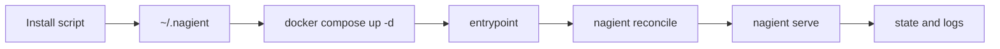

# Nagient

[](https://www.python.org/)
[](https://www.docker.com/)
[](.github/workflows/ci.yml)
[](.github/workflows/release.yml)
[](.github/workflows/update-center.yml)
[](.github/workflows/auto-tag.yml)
[](https://hub.docker.com/r/parampo/nagient)
[](LICENSE)

🇺🇸 English | 🇷🇺 [Русский](README.ru.md)

Lightweight Docker-native agent platform with centralized updates, scripted installs, and tag-driven releases.

Nagient is built to be easy to install and keep updated on Linux, macOS, and Windows.

## Install Latest Stable

### Linux and macOS

```bash
curl -fsSL https://ngnt-in.ruka.me/install.sh | bash
```

### Windows (PowerShell)

```powershell
irm https://ngnt-in.ruka.me/install.ps1 | iex
```

### Docker image

```bash
docker pull docker.io/parampo/nagient:latest
```

The installer creates a local runtime in `~/.nagient` and starts Nagient via Docker Compose.

After install, use one short control command instead of long compose lines:

```bash
~/.nagient/bin/nagientctl help
```

Detailed installation and operations documentation:

- [docs/README.md](docs/README.md)

## Upgrade and Remove

Use the shortcut command:

```bash
~/.nagient/bin/nagientctl update
```

```powershell
powershell -ExecutionPolicy Bypass -File "$HOME/.nagient/bin/nagientctl.ps1" update
```

Remove installation:

```bash
~/.nagient/bin/nagientctl remove
```

```powershell
powershell -ExecutionPolicy Bypass -File "$HOME/.nagient/bin/nagientctl.ps1" remove
```

To remove all local runtime data, set `NAGIENT_PURGE=true` before running uninstall.

## Quick Start

1. Run installer for your platform.
2. Edit `~/.nagient/config.toml`.
3. Put provider secrets into `~/.nagient/secrets.env`.
4. Run short commands:

```bash
~/.nagient/bin/nagientctl up
~/.nagient/bin/nagientctl status
~/.nagient/bin/nagientctl logs
```

## Short Command Surface

- `nagientctl up|down|restart`
- `nagientctl status|doctor|preflight|reconcile`
- `nagientctl logs [service]`
- `nagientctl update|remove`

## Full CLI Surface

- `nagient init`, `nagient preflight`, `nagient reconcile`, `nagient serve`
- `nagient transport list|scaffold`
- `nagient provider list|scaffold|models`
- `nagient auth status|login|complete|logout`
- `nagient tool list|scaffold|invoke`
- `nagient interaction list|submit`, `nagient approval list|respond`
- `nagient update check`, `nagient manifest render`, `nagient migrations plan`
- `nagient agent turn --request-file ...`

Full command reference with flags is in [docs/README.md](docs/README.md).

## Runtime Flow



## Notes

- Architecture details: [docs/architecture.md](docs/architecture.md)
- Russian architecture notes: [docs/architecture.ru.md](docs/architecture.ru.md)
- License: [LICENSE](LICENSE)

Built with care for practical day-to-day operations.
