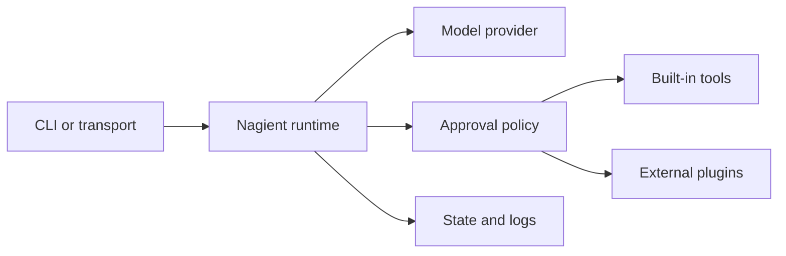

<h1 align="center">Nagient</h1>

<div align="center">
<pre>
███╗░░██╗░█████╗░░██████╗░██╗███████╗███╗░░██╗████████╗
████╗░██║██╔══██╗██╔════╝░██║██╔════╝████╗░██║╚══██╔══╝
██╔██╗██║███████║██║░░██╗░██║█████╗░░██╔██╗██║░░░██║░░░
██║╚████║██╔══██╗██║░░╚██╗██║██╔══╝░░██║╚████║░░░██║░░░
██║░╚███║██║██╔██║╚██████╔╝██║███████╗██║░╚███║░░░██║░░░
╚═╝░░╚══╝╚═╝░░░╚═════╝░╚═╝╚══════╝╚═╝░░╚══╝░░░╚═╝░░░
</pre>
</div>

<p align="center">
  A self-hosted AI agent runtime with controlled tools, pluggable transports, and predictable operations.
</p>

<p align="center">
  <a href="README.ru.md">Русская версия</a> ·
  <a href="docs/user/README.md">User guide</a> ·
  <a href="docs/developer/README.md">Developer guide</a> ·
  <a href="docs/plugins.md">Plugin Hub</a>
</p>

<p align="center">
  <a href="https://www.python.org/"></a>
  <a href="https://hub.docker.com/r/parampo/nagient"></a>
  <a href=".github/workflows/ci.yml"></a>
  <a href="LICENSE"></a>
</p>

Nagient runs an AI agent as an observable service instead of tying it to one terminal session. It keeps configuration, secrets, approvals, logs, updates, and extension lifecycle in one runtime that works on a personal computer or a server.

| Capability | What it gives you |
| --- | --- |
| **Provider freedom** | Built-in OpenAI-compatible providers and a stable contract for external providers. |
| **Controlled tools** | Bounded filesystem, shell, Git, jobs, configuration, and explicit approval for sensitive actions. |
| **Multiple entry points** | CLI chat, console, webhook, and separately installed transports such as Telegram. |
| **Plugin Hub** | Reviewed plugins by short ID, arbitrary Git repositories by URL, isolated dependencies, and visible install status. |
| **Operational runtime** | Preflight checks, reconciliation, health state, structured logs, Docker Compose, and tag-driven updates. |
| **Portable core** | Python 3.11+, Linux, macOS, Windows, Docker, and process plugins written in any language. |

---

## Quick Install

### Linux and macOS

```bash
curl -fsSL https://ngnt-in.ruka.me/install.sh | bash
nagient setup
```

### Windows PowerShell

```powershell
irm https://ngnt-in.ruka.me/install.ps1 | iex
powershell -ExecutionPolicy Bypass -File "$HOME/.nagient/bin/nagient.ps1" setup
```

### Docker Compose on a server

```bash
git clone https://github.com/KOSFin/nagient.git
cd nagient
cp .env.example .env
${EDITOR:-vi} .env
docker compose up -d
docker compose exec nagient nagient status
```

Docker is optional for a source checkout on a personal computer:

```bash
bash scripts/install-local.sh --source .
export PATH="$HOME/.nagient/bin:$PATH"
nagient setup
```

Read the [installation guide](docs/install.md) for supported layouts or the [server deployment guide](docs/deploy.md) for the complete Compose flow.

---

## Getting Started

```bash
nagient setup       # choose a provider and configure the runtime
nagient chat        # start a direct CLI conversation
nagient preflight   # validate configuration and plugins
nagient up           # start the managed runtime
nagient status       # inspect health and activation state
nagient logs         # inspect recent runtime logs
```

Use `nagient paths` to resolve runtime aliases such as `@config`, `@secrets`, `@plugins`, and `@workspace`.

---

## Plugin Hub

Telegram and GitHub API integrations are independent plugins, not copies embedded in the core package. Run the installer without arguments to browse verified plugins and see what is already installed:

```bash
nagient plugin install
```

Install a verified plugin by short ID:

```bash
nagient plugin install nagient.telegram
nagient plugin install nagient.github_api
```

Or install any compatible Git repository directly:

```bash
nagient plugin install https://github.com/owner/nagient-plugin.git
```

| Verified plugin | Type | Repository | Install command |
| --- | --- | --- | --- |
| **Telegram Transport** | Transport | [Source and configuration](https://github.com/KOSFin/nagient-transport-telegram) | `nagient plugin install nagient.telegram` |
| **GitHub API Tool** | Tool | [Source and configuration](https://github.com/KOSFin/nagient-tool-github-api) | `nagient plugin install nagient.github_api` |
| **Plugin Template** | Starter | [Create a new plugin](https://github.com/KOSFin/nagient-plugin-template) | Use the repository template |

The [Plugin Hub guide](docs/plugins.md) covers discovery, installation, configuration, updates, trust, and Docker deployment.

---

## How It Fits Together



The runtime discovers providers, transports, and tools from manifests. External plugins remain under `~/.nagient`, so their release cycle and dependencies stay separate from the core.

---

## Documentation

Everything is available in English and Russian. Start with the path that matches what you are trying to do.

| Section | Article | What it covers |
| --- | --- | --- |
| **Start here** | [User guide](docs/user/README.md) | The shortest path from installation to a working agent. |
| **Start here** | [Installation and updates](docs/install.md) | Hosted installer, local runtime, upgrade, and removal. |
| **Start here** | [Server deployment](docs/deploy.md) | Complete env-only Docker Compose setup. |
| **Use Nagient** | [Commands and daily operations](docs/commands.md) | CLI commands, chat, status, diagnostics, and lifecycle. |
| **Use Nagient** | [Configuration and secrets](docs/configuration.md) | Runtime files, profiles, aliases, tools, and secret handling. |
| **Use Nagient** | [Environment variable reference](docs/env.md) | Installer, Compose, provider, transport, and plugin variables. |
| **Use Nagient** | [Troubleshooting](docs/troubleshooting.md) | Startup, provider, plugin, Docker, and update failures. |
| **Plugins** | [Plugin Hub and verified catalog](docs/plugins.md) | Find, install, configure, update, and remove plugins. |
| **Plugins** | [Plugin guide for operators](docs/user/plugins.md) | Personal computer and Docker installation workflows. |
| **Build plugins** | [Developer guide](docs/developer/README.md) | Entry point for contributors and plugin authors. |
| **Build plugins** | [Build your first plugin](docs/PLUGIN_DEVELOPMENT.md) | Template, manifests, packaging, validation, and publishing. |
| **Build plugins** | [Plugin contracts](docs/plugin-contracts.md) | Python and process runtime protocols. |
| **Build Nagient** | [Architecture](docs/architecture.md) | Boundaries, dependency policy, runtime flow, and security. |
| **Build Nagient** | [Testing and CI](docs/developer/testing.md) | Local checks and test layers. |
| **Project** | [Contributing](CONTRIBUTING.md) | Development workflow and contribution rules. |
| **Project** | [Changelog](CHANGELOG.md) | Release history and notable changes. |

Russian readers can use the [complete Russian documentation index](docs/README.ru.md).

---

## License

Nagient is released under the [MIT License](LICENSE).
