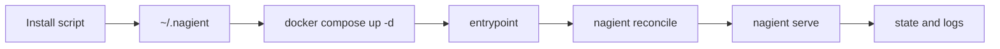

# Nagient

```text
███╗░░██╗░█████╗░░██████╗░██╗███████╗███╗░░██╗████████╗
████╗░██║██╔══██╗██╔════╝░██║██╔════╝████╗░██║╚══██╔══╝
██╔██╗██║███████║██║░░██╗░██║█████╗░░██╔██╗██║░░░██║░░░
██║╚████║██╔══██╗██║░░╚██╗██║██╔══╝░░██║╚████║░░░██║░░░
██║░╚███║██║██╔██║╚██████╔╝██║███████╗██║░╚███║░░░██║░░░
╚═╝░░╚══╝╚═╝░░░╚═════╝░╚═╝╚══════╝╚═╝░░╚══╝░░░╚═╝░░░
```

[](https://www.python.org/)
[](https://www.docker.com/)
[](.github/workflows/ci.yml)
[](.github/workflows/release.yml)
[](.github/workflows/update-center.yml)
[](.github/workflows/auto-tag.yml)
[](https://hub.docker.com/r/parampo/nagient)
[](LICENSE)

🇺🇸 English | 🇷🇺 [Русский](README.ru.md)

Docker-native agent platform with centralized updates, scripted installation, and tag-driven releases.

Nagient is designed for predictable installation and updates on Linux, macOS, and Windows.

## Install Latest Stable

### Linux and macOS

```bash
curl -fsSL https://ngnt-in.ruka.me/install.sh | bash
```

### Windows (PowerShell)

```powershell
irm https://ngnt-in.ruka.me/install.ps1 | iex
```

### Docker image

```bash
docker pull docker.io/parampo/nagient:latest
```

The installer creates a local runtime in `~/.nagient` and starts Nagient via Docker Compose.

### Deploy on a server (Docker Compose)

To run Nagient on your own server without the hosted installer, use the
ready-to-run [docker-compose.yml](docker-compose.yml) in the repository root:

```bash
git clone https://github.com/KOSFin/nagient.git
cd nagient
cp .env.example .env
${EDITOR:-vi} .env          # set provider/transport variables and secrets
docker compose up -d        # no Nagient CLI or generated-file editing required
docker compose exec nagient nagient status
```

Full walkthrough: [docs/deploy.md](docs/deploy.md) ([Русский](docs/deploy.ru.md)).

Docker is optional for personal computers. From a source checkout, use the
lightweight local runtime installer:

```bash
bash scripts/install-local.sh --source .
export PATH="$HOME/.nagient/bin:$PATH"
nagient setup
```

The regular hosted installer remains Docker Compose based; see the [local
runtime guide](docs/install.md#docker-free-local-runtime) for the distinction.

After installation, use one short control command instead of long Docker Compose commands:

```bash
nagient help
```

Detailed documentation:

- English index: [docs/README.md](docs/README.md)
- Russian index: [docs/README.ru.md](docs/README.ru.md)
- User Guide: [docs/user/README.md](docs/user/README.md)
- Developer Guide: [docs/developer/README.md](docs/developer/README.md)
- Official plugin catalog: [docs/plugins.md](docs/plugins.md) ([Русский](docs/plugins.ru.md))

## Upgrade and Remove

Use the shortcut command:

```bash
nagient update
```

```powershell
powershell -ExecutionPolicy Bypass -File "$HOME/.nagient/bin/nagient.ps1" update
```

Remove installation:

```bash
nagient remove
```

```powershell
powershell -ExecutionPolicy Bypass -File "$HOME/.nagient/bin/nagient.ps1" remove
```

To remove all local runtime data, set `NAGIENT_PURGE=true` before running uninstall.

## Quick Start

1. Run installer for your platform.
2. Run `nagient setup`.
3. Use `nagient paths` to inspect aliases such as `@config`, `@secrets`, `@prompts`, and `@tools`.
4. Use `nagient chat` for a direct CLI console session with the configured provider.
5. Run short commands:

```bash
nagient up
nagient status
nagient logs
```

## Plugin workflow

Extensions are separate from the core runtime and can be reviewed before they
are installed. The catalog is the shortest path for a new operator:

```bash
nagient plugin catalog list
nagient plugin catalog install <plugin-id>
nagient preflight
nagient status
```

## Short Command Surface

- `nagient up|down|restart`
- `nagient status|doctor|preflight|reconcile`
- `nagient logs [service]`
- `nagient update|remove`

## Full CLI Surface

- `nagient init`, `nagient help`, `nagient paths`, `nagient plugins`, `nagient preflight`, `nagient reconcile`, `nagient serve`
- `nagient setup`, `nagient chat`
- `nagient transport list|test|scaffold`
- `nagient provider list|scaffold|models`
- `nagient auth status|login|complete|logout`
- `nagient tool list|scaffold|invoke`
- `nagient interaction list|submit`, `nagient approval list|respond`
- `nagient update check`, `nagient manifest render`, `nagient migrations plan`
- `nagient agent turn --request-file ...`

Full command reference with flags is in [docs/README.md](docs/README.md).

## Runtime Flow



## Notes

- Architecture (EN): [docs/architecture.md](docs/architecture.md)
- Architecture (RU): [docs/architecture.ru.md](docs/architecture.ru.md)
- License: [LICENSE](LICENSE)
