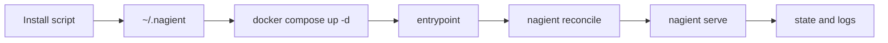

# Nagient

[](https://www.python.org/)
[](https://www.docker.com/)
[](.github/workflows/ci.yml)
[](.github/workflows/release.yml)
[](.github/workflows/update-center.yml)
[](.github/workflows/auto-tag.yml)
[](https://hub.docker.com/r/parampo/nagient)
[](LICENSE)

🇷🇺 Русский | 🇺🇸 [English](README.md)

Легковесная Docker-native агентная платформа с централизованными обновлениями, скриптовой установкой и релизами по тегам.

Nagient рассчитан на быстрый запуск и предсказуемые обновления на Linux, macOS и Windows.

## Установка последней стабильной версии

### Linux и macOS

```bash
curl -fsSL https://ngnt-in.ruka.me/install.sh | bash
```

### Windows (PowerShell)

```powershell
irm https://ngnt-in.ruka.me/install.ps1 | iex
```

### Docker image

```bash
docker pull docker.io/parampo/nagient:latest
```

Установщик создаёт локальный runtime в `~/.nagient` и поднимает сервис через Docker Compose.

После установки используйте одну короткую команду управления:

```bash
~/.nagient/bin/nagientctl help
```

Подробная документация по установке, CLI и конфигурации:

- [docs/README.md](docs/README.md)

## Обновление и удаление

Через короткую команду:

```bash
~/.nagient/bin/nagientctl update
```

```powershell
powershell -ExecutionPolicy Bypass -File "$HOME/.nagient/bin/nagientctl.ps1" update
```

Удаление:

```bash
~/.nagient/bin/nagientctl remove
```

```powershell
powershell -ExecutionPolicy Bypass -File "$HOME/.nagient/bin/nagientctl.ps1" remove
```

Чтобы удалить и контейнеры, и локальные файлы, перед удалением задайте `NAGIENT_PURGE=true`.

## Быстрый старт

1. Запустите установщик под вашу платформу.
2. Отредактируйте `~/.nagient/config.toml`.
3. Добавьте секреты провайдеров в `~/.nagient/secrets.env`.
4. Используйте короткие команды.

```bash
~/.nagient/bin/nagientctl up
~/.nagient/bin/nagientctl status
~/.nagient/bin/nagientctl logs
```

## Короткий набор команд

- `nagientctl up|down|restart`
- `nagientctl status|doctor|preflight|reconcile`
- `nagientctl logs [service]`
- `nagientctl update|remove`

## Полный CLI-набор

- `nagient init`, `nagient preflight`, `nagient reconcile`, `nagient serve`
- `nagient transport list|scaffold`
- `nagient provider list|scaffold|models`
- `nagient auth status|login|complete|logout`
- `nagient tool list|scaffold|invoke`
- `nagient interaction list|submit`, `nagient approval list|respond`
- `nagient update check`, `nagient manifest render`, `nagient migrations plan`
- `nagient agent turn --request-file ...`

Полный справочник с параметрами находится в [docs/README.md](docs/README.md).

## Runtime-схема



## Дополнительно

- Архитектура: [docs/architecture.ru.md](docs/architecture.ru.md)
- English architecture notes: [docs/architecture.md](docs/architecture.md)
- Лицензия: [LICENSE](LICENSE)

Сделано с любовью и уважением к времени пользователя.
