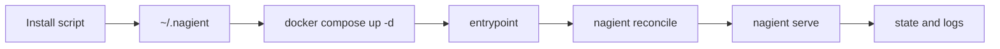

# Nagient

```text
███╗░░██╗░█████╗░░██████╗░██╗███████╗███╗░░██╗████████╗
████╗░██║██╔══██╗██╔════╝░██║██╔════╝████╗░██║╚══██╔══╝
██╔██╗██║███████║██║░░██╗░██║█████╗░░╚██╔██╗██║░░░██║░░░
██║╚████║██╔══██╗██║░░╚██╗██║██╔══╝░░██║╚████║░░░██║░░░
██║░╚███║██║██╔██║╚██████╔╝██║███████╗██║░╚███║░░░██║░░░
╚═╝░░╚══╝╚═╝░░╚═╝░╚═════╝░╚═╝╚══════╝╚═╝░░╚══╝░░░╚═╝░░░
```

[](https://www.python.org/)
[](https://www.docker.com/)
[](.github/workflows/ci.yml)
[](.github/workflows/release.yml)
[](.github/workflows/update-center.yml)
[](.github/workflows/auto-tag.yml)
[](https://hub.docker.com/r/parampo/nagient)
[](LICENSE)

🇷🇺 Русский | 🇺🇸 [English](README.md)

Docker-native агентная платформа с централизованными обновлениями, скриптовой установкой и релизами по тегам.

Nagient рассчитан на предсказуемый запуск и обновления на Linux, macOS и Windows.

## Установка последней стабильной версии

### Linux и macOS

```bash
curl -fsSL https://ngnt-in.ruka.me/install.sh | bash
```

### Windows (PowerShell)

```powershell
irm https://ngnt-in.ruka.me/install.ps1 | iex
```

### Docker image

```bash
docker pull docker.io/parampo/nagient:latest
```

`docker pull` только скачивает образ. Для постоянного запуска на сервере
используйте Compose: он сразу задаёт тома, env-файл, автоперезапуск,
healthcheck и каталог плагинов. Быстрая проверка образа:

```bash
docker run --rm docker.io/parampo/nagient:latest nagient version
```

Установщик создаёт локальный runtime в `~/.nagient` и поднимает сервис через Docker Compose.

### Развёртывание на сервере (Docker Compose)

Чтобы поставить Nagient на свой сервер без хостед-установщика, используйте
готовый [`docker-compose.yml`](docker-compose.yml) и русскую заготовку
`.env.example.ru` в корне репозитория:

```bash
git clone https://github.com/KOSFin/nagient.git
cd nagient
cp .env.example.ru .env
${EDITOR:-vi} .env          # задайте провайдер, транспорт и секреты
docker compose up -d        # CLI и правка сгенерированных файлов не нужны
```

Полное руководство: [docs/deploy.ru.md](docs/deploy.ru.md).

Установка внешних Git-плагинов через Compose описана в разделе
[«Внешние плагины»](docs/deploy.ru.md#5-установка-внешних-плагинов).

После установки используйте одну короткую команду управления:

```bash
nagient help
```

Подробная документация:

- Индекс на английском: [docs/README.md](docs/README.md)
- Индекс на русском: [docs/README.ru.md](docs/README.ru.md)
- Руководство пользователя: [docs/user/README.ru.md](docs/user/README.ru.md)
- Руководство разработчика: [docs/developer/README.ru.md](docs/developer/README.ru.md)
- Разработка и установка плагинов: [docs/PLUGIN_DEVELOPMENT.ru.md](docs/PLUGIN_DEVELOPMENT.ru.md)
- Каталог плагинов: [docs/plugins.ru.md](docs/plugins.ru.md) ([English](docs/plugins.md))

## Обновление и удаление

Через короткую команду:

```bash
nagient update
```

```powershell
powershell -ExecutionPolicy Bypass -File "$HOME/.nagient/bin/nagient.ps1" update
```

Удаление:

```bash
nagient remove
```

```powershell
powershell -ExecutionPolicy Bypass -File "$HOME/.nagient/bin/nagient.ps1" remove
```

Чтобы удалить и контейнеры, и локальные файлы, перед удалением задайте `NAGIENT_PURGE=true`.

## Быстрый старт

1. Запустите установщик под вашу платформу.
2. Запустите `nagient setup`.
3. Используйте `nagient paths`, чтобы увидеть алиасы вроде `@config`, `@secrets`, `@prompts` и `@tools`.
4. Используйте `nagient chat` для прямой CLI-сессии с настроенным provider.
5. Используйте короткие команды.

```bash
nagient up
nagient status
nagient logs
```

## Сценарий плагинов

Расширения устанавливаются отдельно от ядра. Для нового пользователя достаточно
посмотреть проверенный каталог, поставить нужное расширение и проверить runtime:

```bash
nagient plugin catalog list
nagient plugin catalog install <plugin-id>
nagient preflight
nagient status
```

## Короткий набор команд

- `nagient up|down|restart`
- `nagient status|doctor|preflight|reconcile`
- `nagient logs [service]`
- `nagient update|remove`

## Полный CLI-набор

- `nagient init`, `nagient help`, `nagient paths`, `nagient plugins`, `nagient preflight`, `nagient reconcile`, `nagient serve`
- `nagient setup`, `nagient chat`
- `nagient transport list|test|scaffold`
- `nagient provider list|scaffold|models`
- `nagient auth status|login|complete|logout`
- `nagient tool list|scaffold|invoke`
- `nagient interaction list|submit`, `nagient approval list|respond`
- `nagient update check`, `nagient manifest render`, `nagient migrations plan`
- `nagient agent turn --request-file ...`

Полный справочник с параметрами находится в [docs/README.md](docs/README.md).

## Runtime-схема



## Дополнительно

- Архитектура (RU): [docs/architecture.ru.md](docs/architecture.ru.md)
- Архитектура (EN): [docs/architecture.md](docs/architecture.md)
- Лицензия: [LICENSE](LICENSE)
