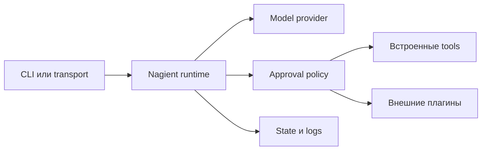

<h1 align="center">Nagient</h1>

<div align="center">
<pre>
███╗░░██╗░█████╗░░██████╗░██╗███████╗███╗░░██╗████████╗
████╗░██║██╔══██╗██╔════╝░██║██╔════╝████╗░██║╚══██╔══╝
██╔██╗██║███████║██║░░██╗░██║█████╗░░██╔██╗██║░░░██║░░░
██║╚████║██╔══██╗██║░░╚██╗██║██╔══╝░░██║╚████║░░░██║░░░
██║░╚███║██║██╔██║╚██████╔╝██║███████╗██║░╚███║░░░██║░░░
╚═╝░░╚══╝╚═╝░░░╚═════╝░╚═╝╚══════╝╚═╝░░╚══╝░░░╚═╝░░░
</pre>
</div>

<p align="center">
  Self-hosted runtime для AI-агента с контролируемыми tools, подключаемыми transport и предсказуемой эксплуатацией.
</p>

<p align="center">
  <a href="README.md">English</a> ·
  <a href="docs/user/README.ru.md">Руководство пользователя</a> ·
  <a href="docs/developer/README.ru.md">Руководство разработчика</a> ·
  <a href="docs/plugins.ru.md">Plugin Hub</a>
</p>

<p align="center">
  <a href="https://www.python.org/"></a>
  <a href="https://hub.docker.com/r/parampo/nagient"></a>
  <a href=".github/workflows/ci.yml"></a>
  <a href="LICENSE"></a>
</p>

Nagient запускает AI-агента как наблюдаемый сервис, а не как одну терминальную сессию. Конфигурация, секреты, подтверждения, логи, обновления и расширения управляются одним runtime на личном компьютере или сервере.

| Возможность | Что это даёт |
| --- | --- |
| **Свободный выбор provider** | Встроенные OpenAI-совместимые provider и стабильный контракт для внешних интеграций. |
| **Контролируемые tools** | Ограниченные filesystem, shell, Git, jobs, configuration и явное подтверждение опасных действий. |
| **Несколько точек входа** | CLI-чат, console, webhook и отдельно устанавливаемые transport, включая Telegram. |
| **Plugin Hub** | Проверенные плагины по короткому ID, любые Git-репозитории по URL, изолированные зависимости и статус установки. |
| **Эксплуатация** | Preflight, reconcile, health state, структурированные логи, Docker Compose и обновления по тегам. |
| **Переносимое ядро** | Python 3.11+, Linux, macOS, Windows, Docker и process-плагины на любом языке. |

---

## Быстрая установка

### Linux и macOS

```bash
curl -fsSL https://ngnt-in.ruka.me/install.sh | bash
nagient setup
```

### Windows PowerShell

```powershell
irm https://ngnt-in.ruka.me/install.ps1 | iex
powershell -ExecutionPolicy Bypass -File "$HOME/.nagient/bin/nagient.ps1" setup
```

### Docker Compose на сервере

```bash
git clone https://github.com/KOSFin/nagient.git
cd nagient
cp .env.example.ru .env
${EDITOR:-vi} .env
docker compose up -d
docker compose exec nagient nagient status
```

На личном компьютере Docker необязателен:

```bash
bash scripts/install-local.sh --source .
export PATH="$HOME/.nagient/bin:$PATH"
nagient setup
```

Подробности есть в [руководстве по установке](docs/install.ru.md) и [руководстве по развёртыванию на сервере](docs/deploy.ru.md).

---

## Первый запуск

```bash
nagient setup       # выбрать provider и настроить runtime
nagient chat        # открыть прямой CLI-чат
nagient preflight   # проверить конфигурацию и плагины
nagient up           # запустить управляемый runtime
nagient status       # посмотреть health и состояние активации
nagient logs         # открыть последние логи
```

Команда `nagient paths` раскрывает runtime-алиасы `@config`, `@secrets`, `@plugins` и `@workspace`.

---

## Plugin Hub

Telegram и GitHub API теперь живут в отдельных репозиториях и не дублируются внутри ядра. Запустите установщик без аргументов, чтобы открыть каталог проверенных плагинов и увидеть, какие уже установлены:

```bash
nagient plugin install
```

Установка проверенного плагина по короткому ID:

```bash
nagient plugin install nagient.telegram
nagient plugin install nagient.github_api
```

Можно передать ссылку на любой совместимый Git-репозиторий:

```bash
nagient plugin install https://github.com/owner/nagient-plugin.git
```

| Проверенный плагин | Тип | Репозиторий | Команда установки |
| --- | --- | --- | --- |
| **Telegram Transport** | Transport | [Код и настройка](https://github.com/KOSFin/nagient-transport-telegram) | `nagient plugin install nagient.telegram` |
| **GitHub API Tool** | Tool | [Код и настройка](https://github.com/KOSFin/nagient-tool-github-api) | `nagient plugin install nagient.github_api` |
| **Plugin Template** | Шаблон | [Создать новый плагин](https://github.com/KOSFin/nagient-plugin-template) | Использовать шаблон репозитория |

[Руководство по Plugin Hub](docs/plugins.ru.md) описывает поиск, установку, настройку, обновление, доверие и Docker-сценарий.

---

## Как всё связано



Runtime обнаруживает providers, transports и tools по манифестам. Внешние плагины остаются в `~/.nagient`, поэтому их релизы и зависимости не связаны с релизами ядра.

---

## Документация

Все основные статьи доступны на русском и английском. Выберите раздел по задаче.

| Раздел | Статья | Что внутри |
| --- | --- | --- |
| **Начало работы** | [Руководство пользователя](docs/user/README.ru.md) | Кратчайший путь от установки до рабочего агента. |
| **Начало работы** | [Установка и обновления](docs/install.ru.md) | Установщик, локальный runtime, обновление и удаление. |
| **Начало работы** | [Развёртывание на сервере](docs/deploy.ru.md) | Полная настройка Docker Compose через `.env`. |
| **Использование** | [Команды и ежедневная работа](docs/commands.ru.md) | CLI, чат, status, диагностика и lifecycle. |
| **Использование** | [Конфигурация и секреты](docs/configuration.ru.md) | Runtime-файлы, профили, алиасы, tools и секреты. |
| **Использование** | [Справочник переменных окружения](docs/env.ru.md) | Переменные установщика, Compose, providers, transports и плагинов. |
| **Использование** | [Диагностика проблем](docs/troubleshooting.ru.md) | Ошибки запуска, provider, плагинов, Docker и обновлений. |
| **Плагины** | [Plugin Hub и проверенный каталог](docs/plugins.ru.md) | Поиск, установка, настройка, обновление и удаление плагинов. |
| **Плагины** | [Плагины для пользователя](docs/user/plugins.ru.md) | Сценарии для личного компьютера и Docker. |
| **Разработка плагинов** | [Руководство разработчика](docs/developer/README.ru.md) | Точка входа для contributors и авторов плагинов. |
| **Разработка плагинов** | [Создание первого плагина](docs/PLUGIN_DEVELOPMENT.ru.md) | Шаблон, манифесты, packaging, проверка и публикация. |
| **Разработка плагинов** | [Контракты плагинов](docs/plugin-contracts.ru.md) | Протоколы Python и process runtime. |
| **Разработка Nagient** | [Архитектура](docs/architecture.ru.md) | Границы, зависимости, runtime flow и безопасность. |
| **Разработка Nagient** | [Тестирование и CI](docs/developer/testing.ru.md) | Локальные проверки и уровни тестов. |
| **Проект** | [Как внести вклад](CONTRIBUTING.md) | Workflow разработки и правила contribution. |
| **Проект** | [История изменений](CHANGELOG.md) | Релизы и важные изменения. |

В [полном русском индексе](docs/README.ru.md) собраны все статьи одним списком.

---

## Лицензия

Nagient распространяется по [лицензии MIT](LICENSE).
